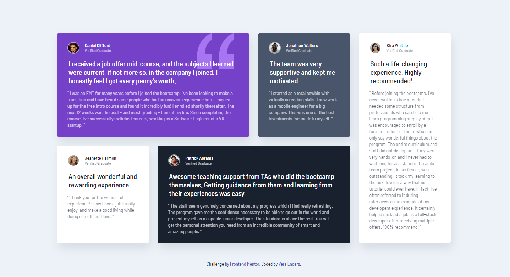
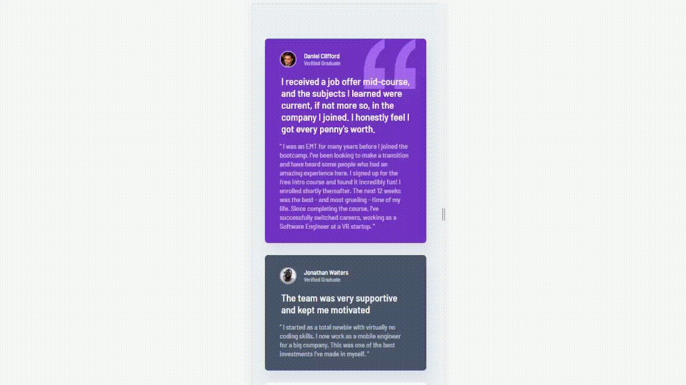

<h1 align="center"> Testimonials Grid Section | <a href="https://www.frontendmentor.io">frontendmentor.io</a></h1>

  <h2><a href="https://veraenders.github.io/testimonials-grid-section/">Live</a>
   |  
  <a href="https://github.com/VeraEnders/testimonials-grid-section">Code</a></h2>
  
This is a solution to the <a href="https://www.frontendmentor.io/challenges/testimonials-grid-section-Nnw6J7Un7">Testimonials grid section challenge on Frontend Mentor</a>.

 

## Table of contents

- [About the project](#about)
- [Built with](#built-with)
- [Useful resources](#useful-resources)
- [Author](#author)
- [Acknowledgments](#acknowledgments)

## About the project
This challenge will be perfect practice for anyone wanting to test their CSS Grid skills. 

Users should be able to:

> View the optimal layout for the site depending on their device's screen size
## Built with

- CSS Grid & Flexbox
- Mobile-first workflow
- Semantic HTML5 markup
- SCSS 
- Clean code principles

## Useful resources

- [A Complete Guide to CSS Grid](https://css-tricks.com/snippets/css/complete-guide-grid/) - An excellent visual guide about CSS Grid
- [Clean Code Developer](https://clean-code-developer.com/grades/grade-1-red/) - A good resource to learn the basic principles of clean code

## Author

- GitHub - [Vera Enders](https://github.com/VeraEnders)
- Frontend Mentor - [@veraenders](https://www.frontendmentor.io/profile/veraenders)

## Acknowledgments

Many thanks to everyone who read this readme. If you have any suggestions feel free to give me feedback. 

I would also like to thank the authors and participants who create and support <a href="https://www.frontendmentor.io">frontendmentor.io</a>. Here I can not only find interesting challenges to practice my front-end knowledge, but also be part of a great helping community of like-minded people.
